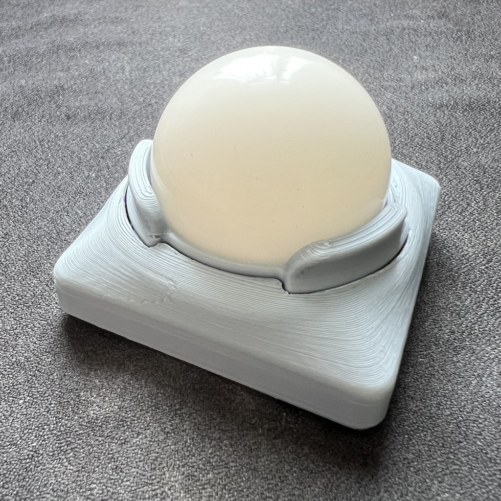

# ZMK Config for mochibella

This is the ZMK firmware config repository for [mochibella](https://github.com/badjeff/mochibella), an open source bluetooth trackball.

*Figure 1: PLA shell

## License

Available under the [MIT](/LICENSE) license.
